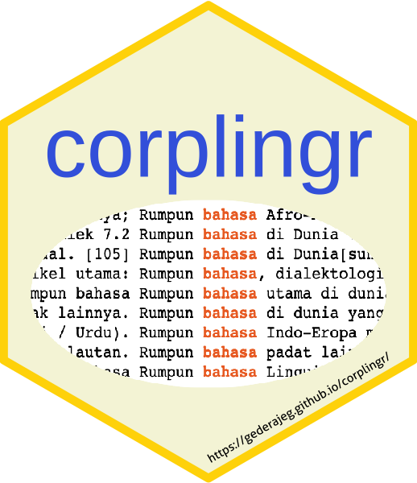

<!-- README.md is generated from README.Rmd. Please edit that file -->

```{r, include = FALSE}
knitr::opts_chunk$set(
  collapse = TRUE,
  comment = "#>",
  fig.path = "man/figures/README-",
  out.width = "100%"
)
```
# corplingr <a href='https://gederajeg.github.io/corplingr/'></a>

<!-- badges: start -->
[](http://www.repostatus.org/#wip)
[](https://github.com/gederajeg/corplingr/actions)
[](https://codecov.io/gh/gederajeg/corplingr?branch=master)
[](https://doi.org/10.17605/OSF.IO/X8CW4)
<!-- badges: end -->

The goal of corplingr is to provide tools for generating concordance, collocates, and word-frequency list from raw text corpora (initiated with the sentence-based corpus of [Indonesian Leipzig Corpora](https://corpora.uni-leipzig.de/en?corpusId=ind_mixed_2013) collection).

## Installation

You can install the development version from [GitHub](https://github.com/) with [remotes](https://remotes.r-lib.org/):

``` r
# install.packages("remotes")
remotes::install_github("gederajeg/corplingr")
```

### How to cite

Please cite this repository as follows if you use it for your academic purposes (e.g., research or teaching):

> Rajeg, Gede Primahadi Wijaya. 2021. corplingr. *Open Science Framework* (OSF). doi: [10.17605/OSF.IO/X8CW4](https://doi.org/10.17605/OSF.IO/X8CW4) [osf.io/x8cw4](https://osf.io/x8cw4/).

More details later...
